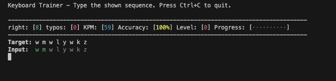

# CLI Keyboard Trainer 

This is a simple keyboard trainer

`npx cli-kt`



you can disable some characters commenting out stuff:

```js
const charset = [
  ...lowercase,
  ...uppercase,
  ...numbers,
  // ...curlies,
  // ...arrows,
  // ...math,
  // ...punctuation,
  // ...quotes,
  // ...pathChars,
  // ...symbols,
];
```
